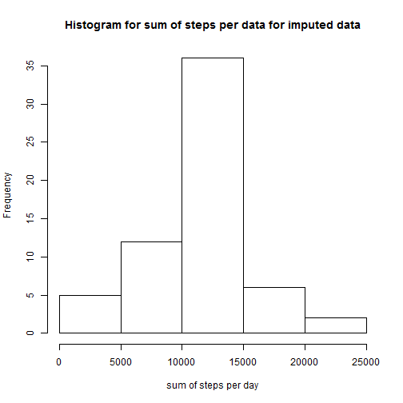
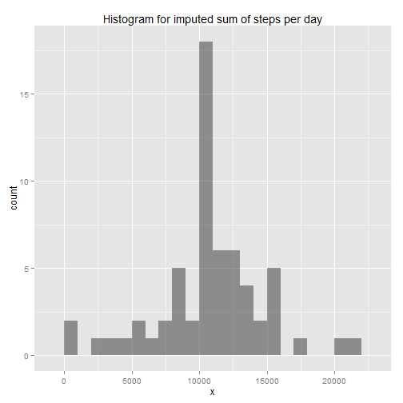

# Reproducible Research: Peer Assessment 1


## Loading and preprocessing the data

```r
setwd("C:/Users/okamal.MGC/Documents/GitHub/RepData_PeerAssessment1")
raw_data <- read.csv("./activity.csv")
raw_data$date <- as.Date(raw_data$date, format = "%Y-%m-%d")
```


## What is mean total number of steps taken per day?

```r
table_means <- aggregate(raw_data$steps, list(raw_data$date), FUN = mean)
table_median <- aggregate(raw_data$steps, list(raw_data$date), FUN = median)
table_sum_steps_per_day <- aggregate(raw_data$steps, list(raw_data$date), FUN = sum)
hist(table_sum_steps_per_day$x, main = "Histogram of sum of steps per day", 
    xlab = "Steps per day")
```

 

```r
final_table <- data.frame(date = table_means$Group.1, mean = table_means$x, 
    median = table_median$x, sum_of_steps = table_sum_steps_per_day$x)
final_table
```

```
##          date    mean median sum_of_steps
## 1  2012-10-01      NA     NA           NA
## 2  2012-10-02  0.4375      0          126
## 3  2012-10-03 39.4167      0        11352
## 4  2012-10-04 42.0694      0        12116
## 5  2012-10-05 46.1597      0        13294
## 6  2012-10-06 53.5417      0        15420
## 7  2012-10-07 38.2465      0        11015
## 8  2012-10-08      NA     NA           NA
## 9  2012-10-09 44.4826      0        12811
## 10 2012-10-10 34.3750      0         9900
## 11 2012-10-11 35.7778      0        10304
## 12 2012-10-12 60.3542      0        17382
## 13 2012-10-13 43.1458      0        12426
## 14 2012-10-14 52.4236      0        15098
## 15 2012-10-15 35.2049      0        10139
## 16 2012-10-16 52.3750      0        15084
## 17 2012-10-17 46.7083      0        13452
## 18 2012-10-18 34.9167      0        10056
## 19 2012-10-19 41.0729      0        11829
## 20 2012-10-20 36.0938      0        10395
## 21 2012-10-21 30.6285      0         8821
## 22 2012-10-22 46.7361      0        13460
## 23 2012-10-23 30.9653      0         8918
## 24 2012-10-24 29.0104      0         8355
## 25 2012-10-25  8.6528      0         2492
## 26 2012-10-26 23.5347      0         6778
## 27 2012-10-27 35.1354      0        10119
## 28 2012-10-28 39.7847      0        11458
## 29 2012-10-29 17.4236      0         5018
## 30 2012-10-30 34.0938      0         9819
## 31 2012-10-31 53.5208      0        15414
## 32 2012-11-01      NA     NA           NA
## 33 2012-11-02 36.8056      0        10600
## 34 2012-11-03 36.7049      0        10571
## 35 2012-11-04      NA     NA           NA
## 36 2012-11-05 36.2465      0        10439
## 37 2012-11-06 28.9375      0         8334
## 38 2012-11-07 44.7326      0        12883
## 39 2012-11-08 11.1771      0         3219
## 40 2012-11-09      NA     NA           NA
## 41 2012-11-10      NA     NA           NA
## 42 2012-11-11 43.7778      0        12608
## 43 2012-11-12 37.3785      0        10765
## 44 2012-11-13 25.4722      0         7336
## 45 2012-11-14      NA     NA           NA
## 46 2012-11-15  0.1424      0           41
## 47 2012-11-16 18.8924      0         5441
## 48 2012-11-17 49.7882      0        14339
## 49 2012-11-18 52.4653      0        15110
## 50 2012-11-19 30.6979      0         8841
## 51 2012-11-20 15.5278      0         4472
## 52 2012-11-21 44.3993      0        12787
## 53 2012-11-22 70.9271      0        20427
## 54 2012-11-23 73.5903      0        21194
## 55 2012-11-24 50.2708      0        14478
## 56 2012-11-25 41.0903      0        11834
## 57 2012-11-26 38.7569      0        11162
## 58 2012-11-27 47.3819      0        13646
## 59 2012-11-28 35.3576      0        10183
## 60 2012-11-29 24.4688      0         7047
## 61 2012-11-30      NA     NA           NA
```


## What is the average daily activity pattern?

```r
interval_means <- aggregate(raw_data$steps, list(raw_data$interval), FUN = mean, 
    na.rm = T)
plot(y = interval_means$x, type = "l", x = interval_means$Group.1, xlab = "Interval", 
    ylab = "Average no of steps", main = "Average Steps per interval across all Days")
```

 

```r

interval_max <- interval_means[which.max(interval_means$x), 1]
```


### Maximum highest average steps accross all days
The 5-minute interval, that have the __highest average__ across all the days in the dataset, is interval __835__

## Imputing missing values
The strategy for imputing missing values is to fill in missing steps in a certain interval with the __mean__ steps computed for the same interval across all days.  
That is done using the __apply__ command.


```r
no_missing_values <- sum(is.na(raw_data$steps))
# filling missing intervals with mean
imputed_data_list <- apply(raw_data, 1, function(x) {
    if (is.na(x[1])) {
        x[1] <- interval_means[as.integer(interval_means$Group.1) == as.integer(x[3]), 
            2]
    }
    return(as.vector(x))
})
imputed_data_frame <- as.data.frame(apply(imputed_data_list, 1, rbind), stringsAsFactors = F)
colnames(imputed_data_frame) <- c("steps", "date", "interval")
imputed_data_frame$steps <- as.numeric(imputed_data_frame$steps)
imputed_data_frame$date <- as.Date(imputed_data_frame$date, format = "%Y-%m-%d")
imputed_data_frame$interval <- as.integer(imputed_data_frame$interval)

imputed_sum_steps_per_day <- aggregate(imputed_data_frame$steps, list(imputed_data_frame$date), 
    FUN = sum)
hist(imputed_sum_steps_per_day$x, main = "Histogram for sum of steps per data for imputed data", 
    xlab = "sum of steps per day")
```

 

```r

imputed_means <- aggregate(imputed_data_frame$steps, list(imputed_data_frame$date), 
    FUN = mean)
imputed_median <- aggregate(imputed_data_frame$steps, list(imputed_data_frame$date), 
    FUN = median)


nrows_imputed_data <- dim(imputed_means)[1]
type_data <- rep(c("imputed", "original"), each = nrows_imputed_data)
total_mean_data <- cbind(rbind(imputed_means, table_means), type = type_data)
total_median_data <- cbind(rbind(imputed_median, table_median), type = type_data)
```


Here is the histograms for the imputed data 


```r

require(ggplot2)
```

```
## Loading required package: ggplot2
```

```r
ggplot(imputed_sum_steps_per_day, aes(x = x)) + geom_histogram(binwidth = 1000, 
    alpha = 0.5, position = "identity") + labs(title = "Histogram for imputed sum of steps per day")
```

 

```r
ggplot(total_mean_data, aes(x = x, fill = type, colour = type)) + geom_histogram(binwidth = 3, 
    alpha = 0.5, position = "identity") + labs(title = "Histogram for original and imputed means")
```

 

```r
ggplot(total_median_data, aes(x = x, fill = type, colour = type)) + geom_histogram(binwidth = 3, 
    alpha = 0.5, position = "identity") + labs(title = "Histogram original and imputed medians")
```

 


Here is the imputed mean and median total number of steps taken per day.
### Imputed mean steps per day


```r
imputed_means
```

```
##       Group.1       x
## 1  2012-10-01 37.3826
## 2  2012-10-02  0.4375
## 3  2012-10-03 39.4167
## 4  2012-10-04 42.0694
## 5  2012-10-05 46.1597
## 6  2012-10-06 53.5417
## 7  2012-10-07 38.2465
## 8  2012-10-08 37.3826
## 9  2012-10-09 44.4826
## 10 2012-10-10 34.3750
## 11 2012-10-11 35.7778
## 12 2012-10-12 60.3542
## 13 2012-10-13 43.1458
## 14 2012-10-14 52.4236
## 15 2012-10-15 35.2049
## 16 2012-10-16 52.3750
## 17 2012-10-17 46.7083
## 18 2012-10-18 34.9167
## 19 2012-10-19 41.0729
## 20 2012-10-20 36.0938
## 21 2012-10-21 30.6285
## 22 2012-10-22 46.7361
## 23 2012-10-23 30.9653
## 24 2012-10-24 29.0104
## 25 2012-10-25  8.6528
## 26 2012-10-26 23.5347
## 27 2012-10-27 35.1354
## 28 2012-10-28 39.7847
## 29 2012-10-29 17.4236
## 30 2012-10-30 34.0938
## 31 2012-10-31 53.5208
## 32 2012-11-01 37.3826
## 33 2012-11-02 36.8056
## 34 2012-11-03 36.7049
## 35 2012-11-04 37.3826
## 36 2012-11-05 36.2465
## 37 2012-11-06 28.9375
## 38 2012-11-07 44.7326
## 39 2012-11-08 11.1771
## 40 2012-11-09 37.3826
## 41 2012-11-10 37.3826
## 42 2012-11-11 43.7778
## 43 2012-11-12 37.3785
## 44 2012-11-13 25.4722
## 45 2012-11-14 37.3826
## 46 2012-11-15  0.1424
## 47 2012-11-16 18.8924
## 48 2012-11-17 49.7882
## 49 2012-11-18 52.4653
## 50 2012-11-19 30.6979
## 51 2012-11-20 15.5278
## 52 2012-11-21 44.3993
## 53 2012-11-22 70.9271
## 54 2012-11-23 73.5903
## 55 2012-11-24 50.2708
## 56 2012-11-25 41.0903
## 57 2012-11-26 38.7569
## 58 2012-11-27 47.3819
## 59 2012-11-28 35.3576
## 60 2012-11-29 24.4688
## 61 2012-11-30 37.3826
```


### Imputed median steps per day


```r
imputed_median
```

```
##       Group.1     x
## 1  2012-10-01 34.11
## 2  2012-10-02  0.00
## 3  2012-10-03  0.00
## 4  2012-10-04  0.00
## 5  2012-10-05  0.00
## 6  2012-10-06  0.00
## 7  2012-10-07  0.00
## 8  2012-10-08 34.11
## 9  2012-10-09  0.00
## 10 2012-10-10  0.00
## 11 2012-10-11  0.00
## 12 2012-10-12  0.00
## 13 2012-10-13  0.00
## 14 2012-10-14  0.00
## 15 2012-10-15  0.00
## 16 2012-10-16  0.00
## 17 2012-10-17  0.00
## 18 2012-10-18  0.00
## 19 2012-10-19  0.00
## 20 2012-10-20  0.00
## 21 2012-10-21  0.00
## 22 2012-10-22  0.00
## 23 2012-10-23  0.00
## 24 2012-10-24  0.00
## 25 2012-10-25  0.00
## 26 2012-10-26  0.00
## 27 2012-10-27  0.00
## 28 2012-10-28  0.00
## 29 2012-10-29  0.00
## 30 2012-10-30  0.00
## 31 2012-10-31  0.00
## 32 2012-11-01 34.11
## 33 2012-11-02  0.00
## 34 2012-11-03  0.00
## 35 2012-11-04 34.11
## 36 2012-11-05  0.00
## 37 2012-11-06  0.00
## 38 2012-11-07  0.00
## 39 2012-11-08  0.00
## 40 2012-11-09 34.11
## 41 2012-11-10 34.11
## 42 2012-11-11  0.00
## 43 2012-11-12  0.00
## 44 2012-11-13  0.00
## 45 2012-11-14 34.11
## 46 2012-11-15  0.00
## 47 2012-11-16  0.00
## 48 2012-11-17  0.00
## 49 2012-11-18  0.00
## 50 2012-11-19  0.00
## 51 2012-11-20  0.00
## 52 2012-11-21  0.00
## 53 2012-11-22  0.00
## 54 2012-11-23  0.00
## 55 2012-11-24  0.00
## 56 2012-11-25  0.00
## 57 2012-11-26  0.00
## 58 2012-11-27  0.00
## 59 2012-11-28  0.00
## 60 2012-11-29  0.00
## 61 2012-11-30 34.11
```


Yes there is a difference in some days between the original data and the imputed data.

## Are there differences in activity patterns between weekdays and weekends?

```r
imputed_means_with_weekdata <- imputed_data_frame
imputed_means_with_weekdata$weekday <- weekdays(imputed_data_frame$date)
imputed_means_with_weekdata$day_type <- ifelse(imputed_means_with_weekdata$weekday %in% 
    c("Saturday", "Sunday"), "Weekend", "Weekday")
mean_steps_weekdays <- aggregate(imputed_means_with_weekdata$steps, list(imputed_means_with_weekdata$interval, 
    imputed_means_with_weekdata$day_type), FUN = mean)
colnames(mean_steps_weekdays) <- c("interval", "day_type", "mean_steps")

require(lattice)
```

```
## Loading required package: lattice
```

```r
xyplot(mean_steps ~ interval | day_type, data = mean_steps_weekdays, layout = c(1, 
    2), type = "l", ylab = "Mean number of steps")
```

 


